---
### 👉作者QQ ：1556708905 微信：zheng0123Long (支持修改、部署调试、定制毕设)

### 👉接网站建设、小程序、H5、APP、各种系统等

### 👉选题+开题报告+任务书+程序定制+安装调试+ppt 都可以做
---

**博客地址：
[https://blog.csdn.net/2303_76227485/article/details/134977220](https://blog.csdn.net/2303_76227485/article/details/134977220)**

**视频演示：
[https://www.bilibili.com/video/BV1A64y1V7KK/](https://www.bilibili.com/video/BV1A64y1V7KK/)**

**毕业设计所有选题地址：
[https://github.com/zhengjianzhong0107/allProject](https://github.com/zhengjianzhong0107/allProject)**

## 基于Java+Springboot+Vue的实验室预约系统(源代码+数据库+万字论文)114

## 一、系统介绍
本项目前后端分离，本系统分为管理员、教师、学生三种角色

### 1、学生：
1.登录，注册
2.查看实验室列表信息
3.实验室预约
4.查看预约进度并取消
5.查看公告
6.订阅课程
7.实验室报修
8.修改个人信息

### 2、教师：
1.查看并审核预约申请
2.查看已审核预约
3.实验室设备管理，报修
4.查看实验室统计情况

### 3、管理员：
1.用户管理、设备管理、实验室管理、耗材管理，包括增删查改，账户禁用。
2.查看并审核预约
3.查看报修信息
4.发布公告
5.发布课程，添加删除课程
6.查看实验室使用情况

文档截图

## 二、所用技术

后端技术栈：

- Springboot
- MybatisPlus
- Mysql
- Maven
- SpringCloud

前端技术栈：

- Vue 
- Vue-router 
- axios 
- elementUi

## 三、环境介绍

基础环境 :IDEA/eclipse, JDK1.8, Mysql5.7及以上,Maven3.6, node14, nginx

所有项目以及源代码本人均调试运行无问题 可支持远程调试运行

## 四、页面截图
### 1、学生
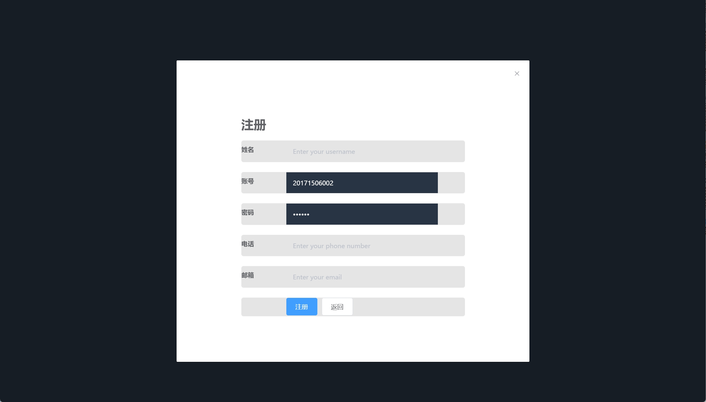

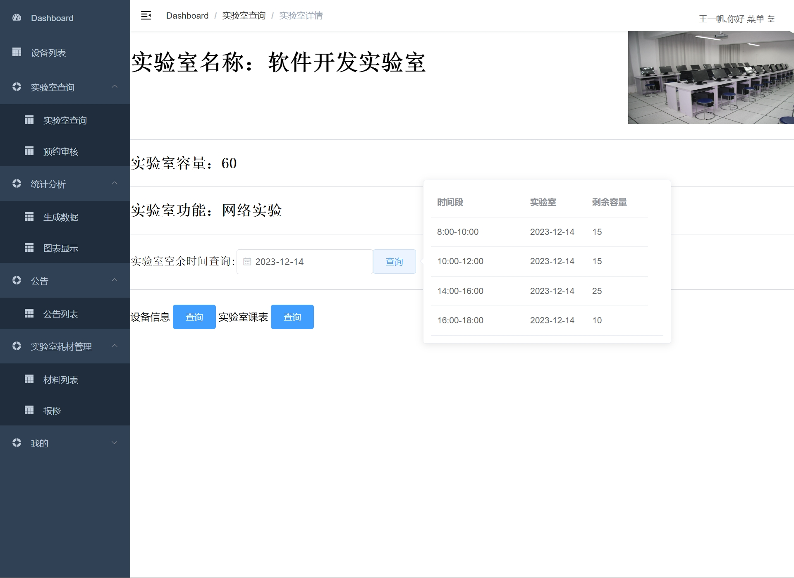

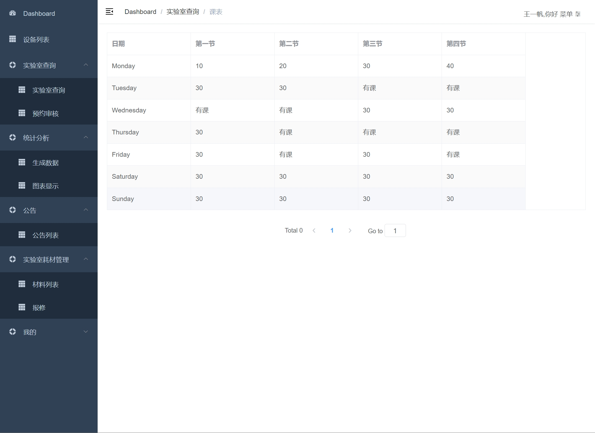

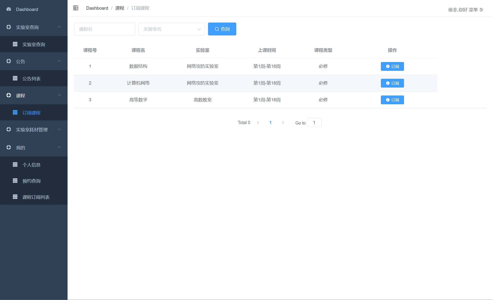
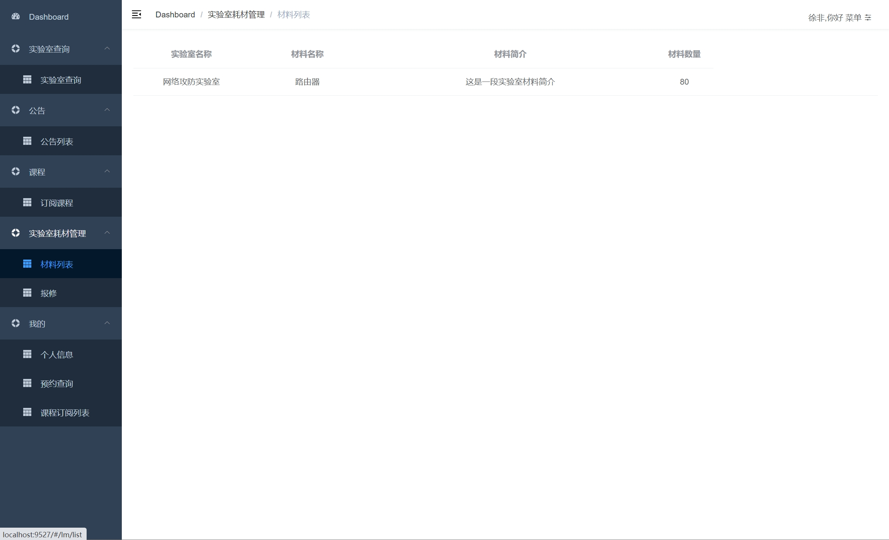

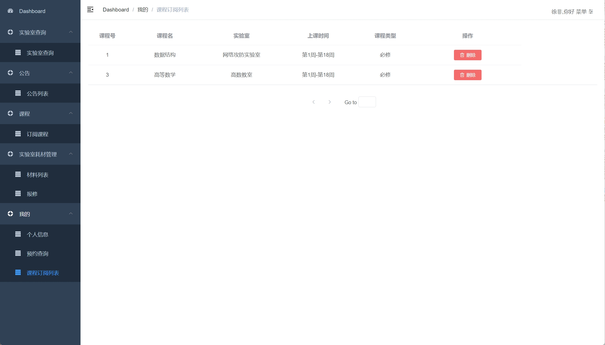
### 2、老师
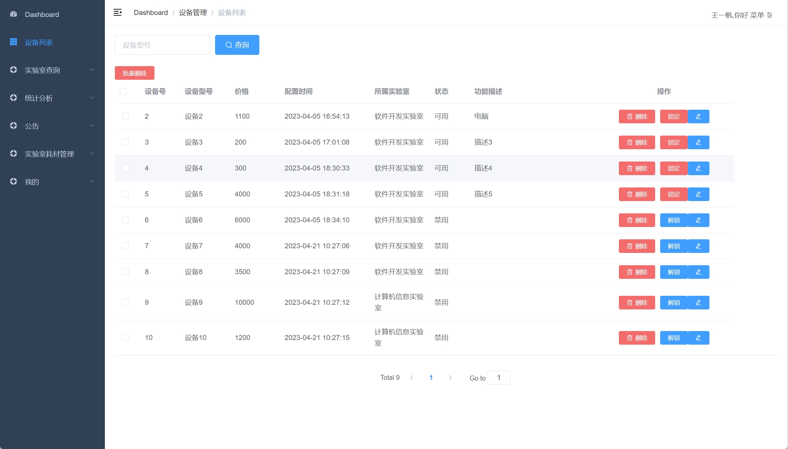
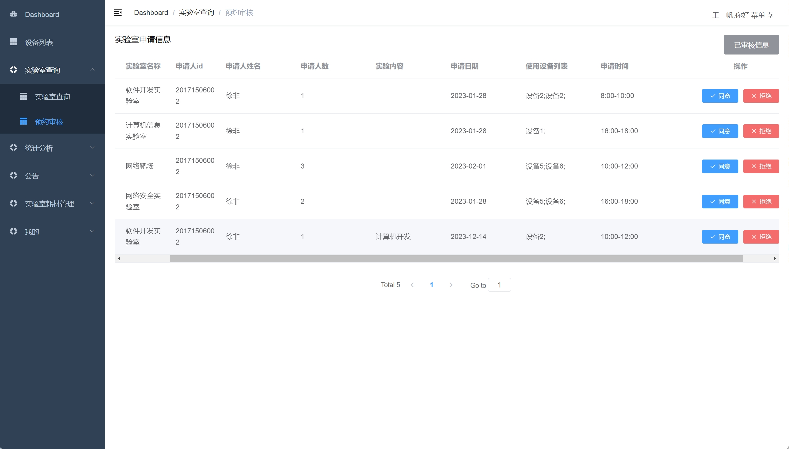

### 3、管理员
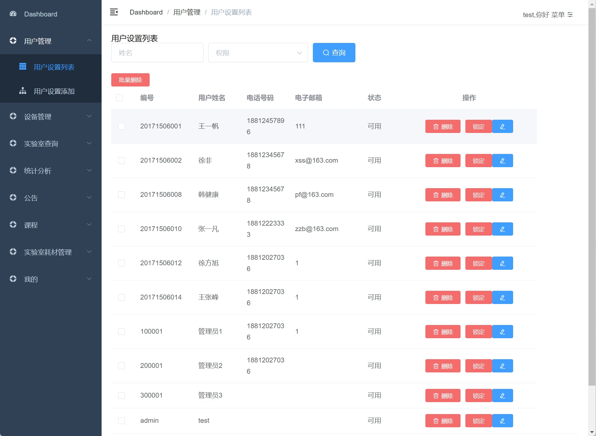
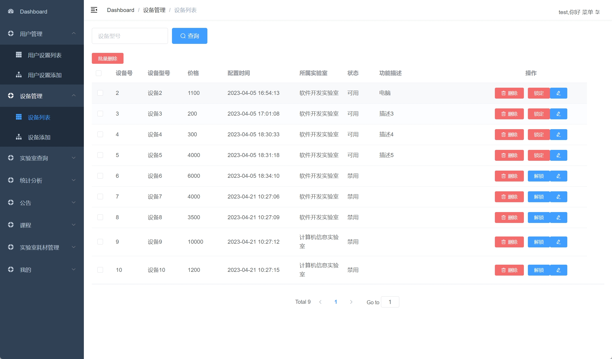
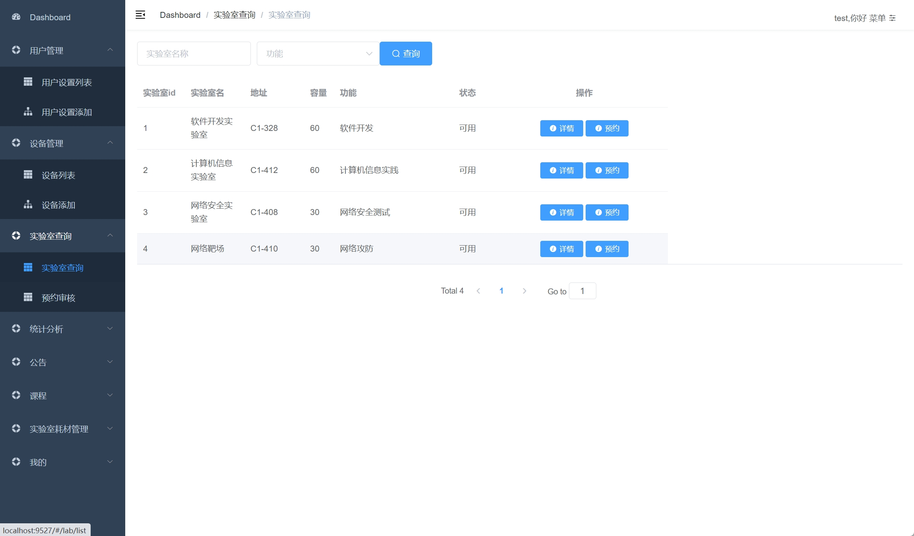

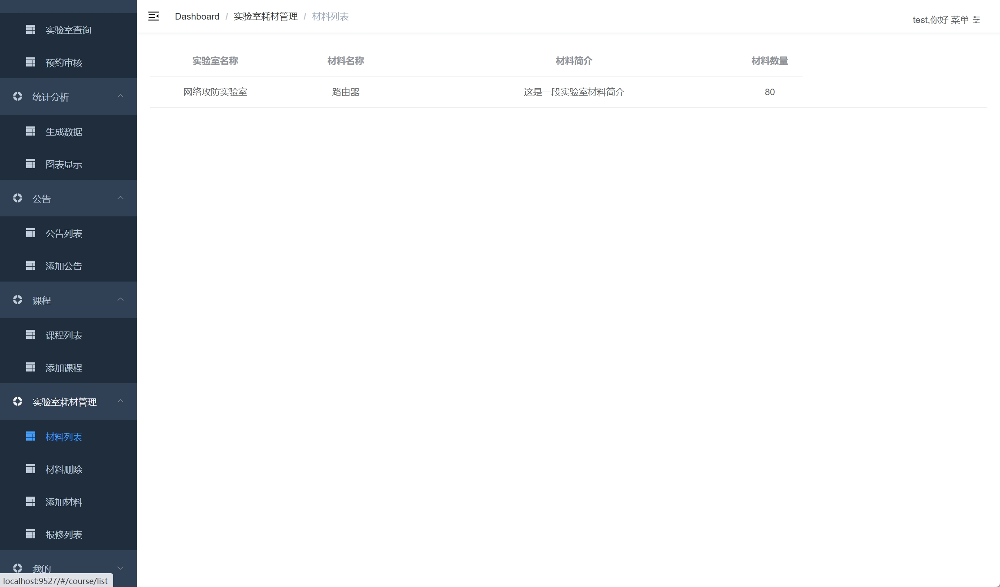

## 五、浏览地址

访问地址：http://localhost:9527/
- 学生账号/密码：20171506001/123456
- 教师账号/密码：20171506002/123456
- 管理员账号/密码：admin/123456

## 六、部署教程
1. 打开文件夹中的 nginx/nginx.exe，双击启动，使用Navicat或者其它工具，在mysql中创建对应名称的数据库，并执行项目的sql文件；
2. 使用IDEA/Eclipse导入lrms项目，若为maven项目请选择maven，等待依赖下载完成；
3. 修改项目里面的数据库配置
4. 启动项目的六个服务
5. vscode或idea打开front项目，
6. 在编译器中打开terminal，执行npm install 依赖下载完成后执行 npm run dev,执行成功后会显示访问地址

